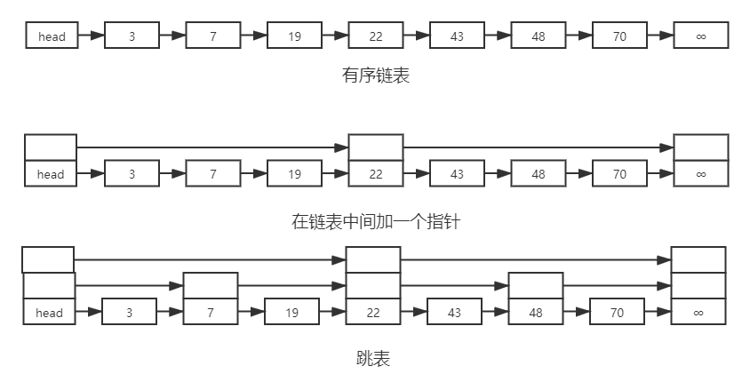

已排序表的二分搜索有很高的搜索效率，但是这种搜索不能在普通的链表上进行，这是因为链表结构难以有效计算中间节点  
跳表是一种提高链表搜索效率的结构  

  

如图，搜索普通链表的最坏状况是 O(n)  
如果在中间加一个指针，先把要搜索的值和中间值进行比对，大于中间值就在前一半搜索，小于就在后一半，复杂度就成了 O(n/2)  

跳表是一个有序链表  
结果中的第i层链，跳过只包含低于第i层链的节点，构成一个单链表  
每个 2^i 个元素有一个 i 级指针  
第 0 层链包含所有元素（最底层）  
第 1 层链是第 0 层的子集  
第 2 层链是第 1 层的子集  
...
第 i 层是第 i-1 层的子集  
第 i 层元素个数是第 i-1 层的一半，所以理想情况下跳表的层数是 log n

[back](1.md)  