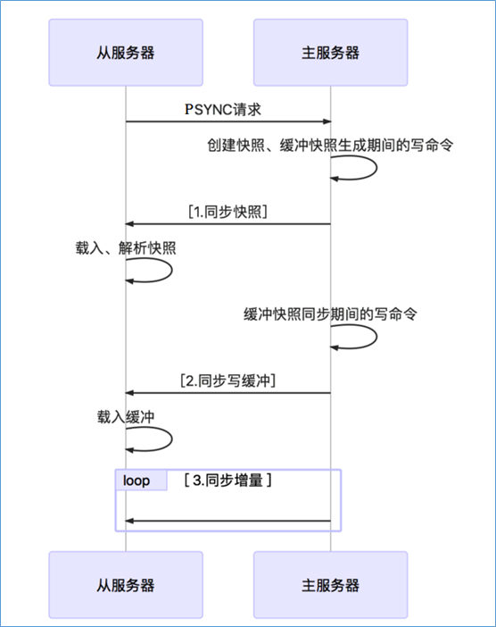

避免持久化数据无法恢复情况导致数据丢失  

需要一个主服务器，一个或多个从服务器  
主服务器可以承载**读写**操作  
从服务器**只读**  

主服务器不需要特殊配置  
从服务器需要的配置如下  

```
replicaof #masterip #masterport
# masterip 主服务器的 ip 地址  
# masterport 主服务器的端口号  
masterauto #master-password
# master-password 主服务器配置的密码  
```

主从复制过程  
- 全量复制：一般用于初次复制场景，将主节点全部数据一次性发送给从节点  
- 部分复制：Master发生每执行一个写命令就会向Slave发送相同的写命令  
处理网络闪断等原因造成数据丢失场景，当从节点再次连上主节点后，主节点补发丢失数据给从节点  
    - run_id：服务器每次启动都会生成一个，可以通过 `info` 命令查看  
    - master_repl_offset：主服务器的复制偏移量，主服务器发生修改时会修改这个值，用于检查主从节点数据是否一致  
    - 主服务器的复制积压缓冲区  



[back](../11.md)  