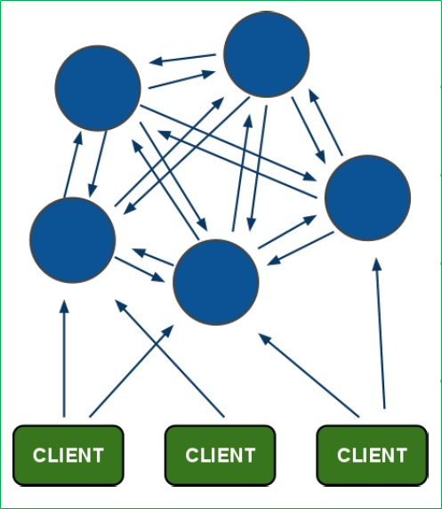

配置多台从服务器并不能拓展redis的存储空间，需要用到集群  
集群的每个节点保存不同的数据，每增加一个节点都会对整个服务器扩容  

集群架构图  
  

客户端进入集群时并没有统一的入口（代理），只需要连接任意一个节点  
集群中的节点是彼此互联的（PING-PONG机制），内部使用二进制协议优化传输速度和带宽  

集群节点下线  
节点是否失效需要超过半数的节点检测为失效  
投票：容错机制  

如果集群中有一个节点失效，那么整个集群进入不可用状态  
所以集群的每个节点都需要从节点来保证可以升级为主节点  
集群中从节点升级不需要哨兵，由其他主节点代替了哨兵的作用  
从服务器不需要具体配置监听哪个主服务器，创建集群时会自动进行主从分配
副本漂移：当某个主节点没有从节点时，会分走其他主节点上多余的从节点  

集群中如何新增数据 [see](14/1.md)  

集群相关配置和命令 [see](14/2.md)  

在集群中使用 `keys *` 命令，只会返回当前连接节点上的所有 key  
根据其他节点上的 key 获取 value 时，会自动跳转到这个节点上  

[back](../11.md)  