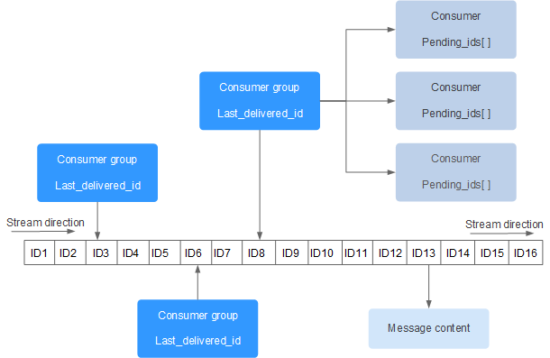

Redis 5.0 的新数据类型  

支持多个消费者等待数据  
pub/sub是发送忘记，但stream所有消息被无限期缓存  
consumer groups 允许一组客户端协调消费相同的信息流  

```
$ xadd [key] [id/*] [field] [value] [field value ...]  
# 发布一个消息  
# id 消息id，m-n 格式，m 是递增的数字，m 相等的情况下 n 递增。可以用 * 表示自动生成
# field/value 消息体相当于一个map  

$ xrange [key] - +
# 查看所有消息，id 从小到大  
# - 表示第一条消息  
# + 表示最后一条消息

$ xrange [key] n1 n2
# 查看 n1 到 n2 范围的消息，n 为消息id  

$ xrevrange [key] - +
# 反向查看消息列表  

$ xread [count c] [block b] streams [key] [id ...]
# 读取消息  
# c 消息数量  
# b 阻塞毫秒数，不设置及非阻塞模式  

$ xread streams [key] $
# 读取最后一条消息  

$ xgroup create [key] [groupname] [id/$] 
# 创建一个消费组。组中的成员共享一个消息队列  

$ xgroup setid [key] [goupname] [id/$]  

$ xgroup destroy [key] [goupname] [id/$]  

$ xgroup delconsumer [key] [goupname] [id/$]  
# 删除一个消费者  

$ xreadgroup group [groupname] [consumername] [count c] [block b] [noack] streams [key ...] [id.../>]  
# 读取组中的消息  
# 使用 > 表示顺序读取并且是未传递给其他消费者的消息  
```

listpack 消息链表  
是对 ziplist 的改进，比ziplist少了一个定位最后一个元素的属性  

  

[back](../16.md)  