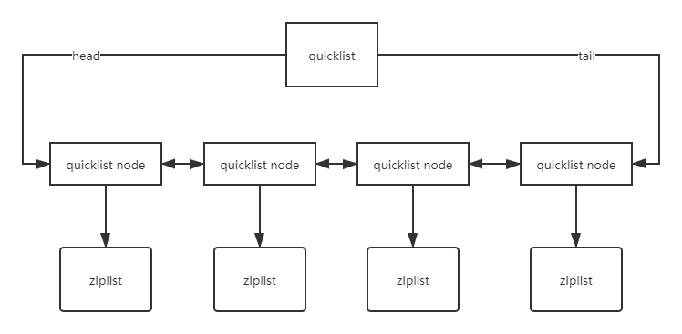

| 类型 | 编码 | object encoding 命令输出 | 对象 |
| :- | :- | :- | :- |
| REDIS_STRING | REDIS_ENCODING_INT | "int" | 使用整数值实现的字符串对象 |
| REDIS_STRING | REDIS_ENCODING_EMBSTR | "embstr" | 使用embstr编码的简单动态字符串实现的字符串对象 |
| REDIS_STRING | REDIS_ENCODING_RAW | "raw" | 使用简单动态字符串实现的字符串对象 |
| REDIS_LIST | REDIS_ENCODING_ZIPLIST | "ziplist" | 使用压缩列表实现的列表对象 |
| REDIS_LIST | REDIS_ENCODING_LINKEDLIST | "linkedlist" | 使用双端链表实现的列表对象 |
| REDIS_HASH | REDIS_ENCODING_ZIPLIST | "ziplist" | 使用压缩列表实现的哈希对象 |
| REDIS_HASH | REDIS_ENCODING_HT | "hashtable" | 使用字典实现的哈希对象 |
| REDIS_SET | REDIS_ENCODING_INTSET | "intset" | 使用整数集合实现的集合对象 |
| REDIS_SET | REDIS_ENCODING_HT | "hashtable" | 使用字典实现的集合对象 |
| REDIS_ZSET | REDIS_ENCODING_ZIPLIST | "ziplist" | 使用压缩列表实现的有序集合对象 |
| REDIS_ZSET | REDIS_ENCODING_SKIPLIST | "skiplist" | 使用跳跃表和字典实现的有序集合对象 |

字符串sds的编码  
- int 8字节的长整型，字符串值是整形时，这个值使用long整形表示  
- embstr \<=44字节的字符串  
- raw \>44字节的字符串  
embstr 只需要一次分配内存，因为 sds 和 redisObject 是连续的，16(redisObject) + 4(sds) + 44(字符串长度) = 64，而 jemalloc 正好可以分配 64 字节的内存单元  
raw 需要分配两次空间，redisObject 和 sds 分开  
3.2 版本以前sds长度是 9 + 39(字符串长度)，所以\>39字节的字符串为raw  

列表  
- ziplist 涉及到压缩算法  
内存布局  
    - bytes: ziplist 分配的字节数
    - tail_offset: 达到尾部的偏移量  
    - length: 存储元素实体个数  
    - content[]: 存储的元素内容  
- linkedlist 双向链表

3.2 版本以后列表使用 quicklist 编码，结合了 ziplist 和 linkedlist 的特点  
一个列表可以存储 2^64-1 个元素（旧版本是 2^32-1)  

  

哈希表  
- ziplist 用于元素个数较少的场景，会转换成 hashtable  
存取复杂度 O(n) ，但由于个数少，hashtable 并不占多少优势  
使用 ziplist 的条件  
    - 元素小于 512 个
    - 所有键值对的键和值的字符串长度小于 64 字节
- hashtable 减少hashtable里的元素并不会转换成 ziplist  

集合  
- intset 集合内都是整数时使用  
- hashtable 一旦包含了字符串，就会从 intset 转换过来  

类似列表，但内部元素无序  
可以存储 2^64-1 个元素  

有序集合  
- ziplist 用于元素个数较少的场景   
使用 ziplist 的条件  
    - 元素小于 512 个
    - 所有键值对的键和值的字符串长度小于 64 字节
- skiplist 效率和平衡树媲美，平均O(logn)，最坏情况O(n)  

[back](../11.md)  