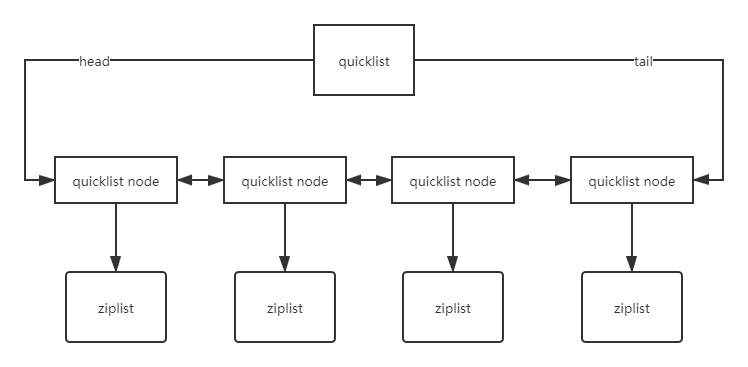

列表  
- ziplist 涉及到压缩算法  
内存布局  
    - bytes: ziplist 分配的字节数
    - tail_offset: 达到尾部的偏移量  
    - length: 存储元素实体个数  
    - content[]: 存储的元素内容  
- linkedlist 双向链表

3.2 版本以后列表使用 quicklist 编码，结合了 ziplist 和 linkedlist 的特点  
一个列表可以存储 2^64-1 个元素（旧版本是 2^32-1)  

  

[back](../9.md)  