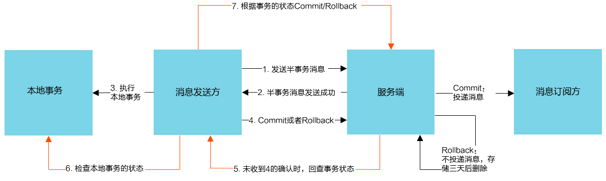

事务消息  
适用于对数据最终一致性有强需求的场景  

- 事务消息  
类似 X/Open XA 的分布式事务功能，通过消息队列 RocketMQ 事务消息能达到分布式事务的最终一致  
- 半事务消息  
暂不能投递的消息，发送方已经成功地将消息发送到了消息队列的服务端，但是服务端未收到生产者对该消息的二次确认，此时该消息被标记成”暂不能投递“  
- 消息回查  
由于网络闪断、生产者应用重启等原因，导致某条事务消息的二次确认丢失，消息队列服务端通过扫描发现某条消息长期处于”半事务消息“时，需要主动向其生产者询问该消息的最终状态（commit 或 rollback）  

  
  

HALF 消息会临时存放到 RMQ_SYS_TRANS_HALF_TOPIC 里  
OP 消息存放到 RMQ_SYS_TRANS_OP_HALF_TOPIC   
- Rollback 只做记录  
- Commit 根据备份消息重新构造并投递  

```Java
public class TransactionProducer {
    public static void main(String[] args) throws Exception {
        //1.创建消息生产者producer，并制定生产者组名
        TransactionMQProducer producer = new TransactionMQProducer("GroupTransaction");
        //2.指定nameserver地址
        producer.setNamesrvAddr("localhost:9876");
        //3.添加事务监听器
        producer.setTransactionListener(new TransactionListener() {
            /**
             * 在该方法执行本地事务
             * @param msg
             * @param arg
             * @return
             */
            @Override
            public LocalTransactionState executeLocalTransaction(Message msg, Object arg) {
                System.out.println("executeLocal:"+msg.getTags());
                if(StringUtils.equals("TAGA",msg.getTags())){
                    return LocalTransactionState.COMMIT_MESSAGE;
                }else if(StringUtils.equals("TAGB",msg.getTags())){
                    return LocalTransactionState.ROLLBACK_MESSAGE;
                }else if(StringUtils.equals("TAGC",msg.getTags())){
                    return LocalTransactionState.UNKNOW;
                }
                return LocalTransactionState.UNKNOW;
            }

            /**
             * 该方法用于MQ进行消息的回查
             * @param msg
             * @return
             */
            @Override
            public LocalTransactionState checkLocalTransaction(MessageExt msg) {
                System.out.println("checkLocalTransaction:"+msg.getTags());
                return LocalTransactionState.COMMIT_MESSAGE;
            }
        });

        //4.启动producer
        producer.start();
        String[] tags = {"TAGA","TAGB","TAGC"};
        for (int i = 0; i < 3; i++) {
            //5.创建消息对象，制定topic、tag 和 消息体
            Message msg = new Message("TransactionTopic", tags[i],
                    ("Hello RocketMQ: " + tags[i]).getBytes(RemotingHelper.DEFAULT_CHARSET)
            );

            //6.发送消息
            SendResult sendResult = producer.sendMessageInTransaction(msg,null);
            //7.获取发送状态
            SendStatus sendStatus = sendResult.getSendStatus();
            System.out.printf("发送结果:%s%n", sendStatus);
            TimeUnit.SECONDS.sleep(1);
        }
        //8.关闭生产者producer
//        producer.shutdown();
    }
}
```

[back](../14.md)  