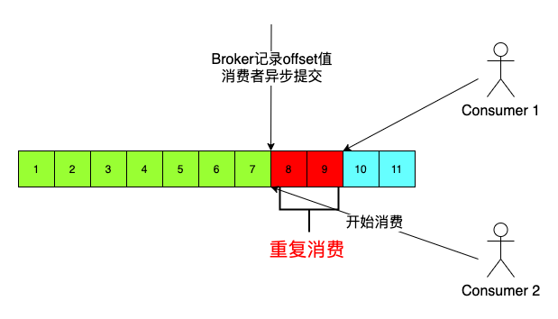

将一个 Topic 下的多个 Queue，在同一个消费者组下的多个消费者实例之间进行重分配  
Reblance 机制本意是为了提升消息的并行处理能力  

触发原因  
- Broker 的宕机、升级等运维操作、队列的扩容缩容  
- 消费者组信息发生变化，如消费者宕机、扩容、缩容，日常发布的停止启动，网络异常导致与 Broker 断开连接，Topic 订阅信息发生变化  

限制  
消费者实例大于队列数量的情况，会出现空闲消费者  

危害  
- 消费暂停  
- 消费突增  
- 重复消费  

[back](../16.md)  