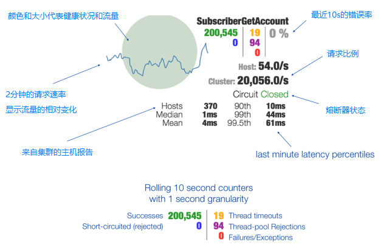

Dashboard 仪表盘以 GUI 的形式展示消费者的执行情况  
包括其处理器方法与 Service 方法的调用执行情况，以及熔断器 CircuitBreaker 的状态等  
基于 SSE ( Server Send Event ) 实现  
页面地址 `http://ip:port/hystrix`，输入 `http://ip:port/actuator/hystrix.stream` 进行监控  

  

[back](../1.md)  