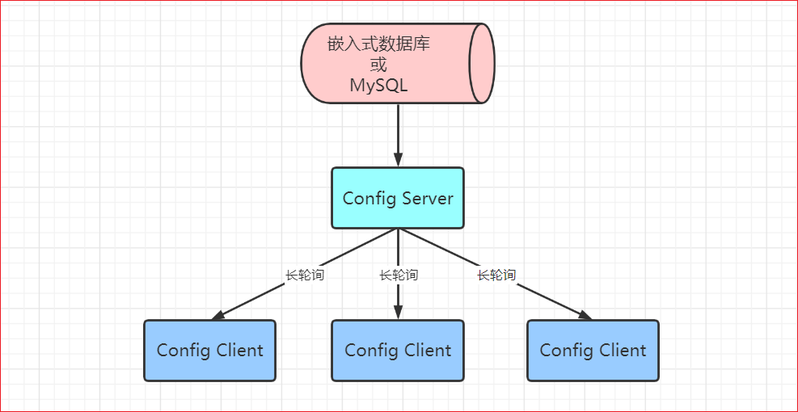
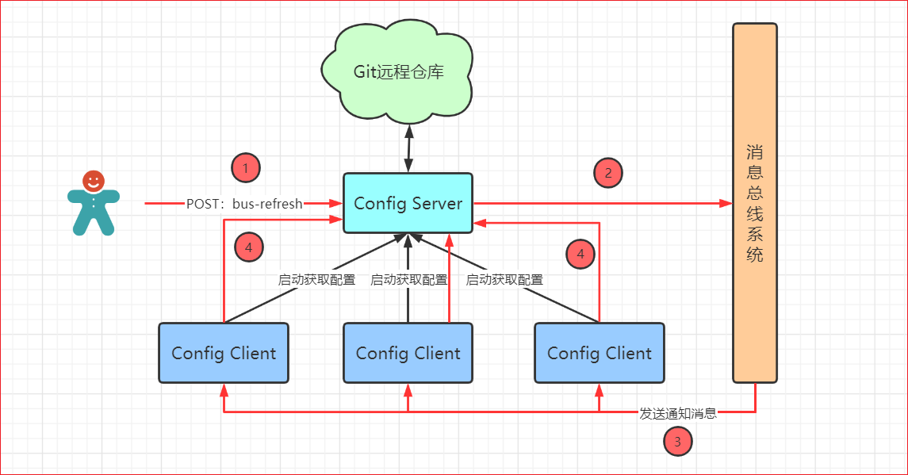

Nacos config 原理  

长轮询模型  

- nacos 将配置数据放到数据库里。如果没有配置数据库，则放到缓存里  
- 客户端向 nacos 节点发起长轮询请求，每 29.5s 一次  
- nacos 先比较服务端缓存数据是否相同  
    - 相同，通过 schadule 延时 30s 后再进行比较  
    - 不相同，返回数据  
- 服务端会采用事件订阅的方式，监听数据变化的事件。如果 schadule 的 30s 期间发生信息变更，一旦收到事件，则触发通知把结果推送到客户端  

push 长轮询模型和 pull 长轮询模型 [see](5/1.md)  

  

---

spring-cloud-config 原理  

- 配置放到 Git 远程仓库里，需要通过 Git 提交修改  
- 用户提交配置时触发post请求给 bus/refresh 接口，通知配置中心服务  
- 配置中心服务通过 spring-cloud-bus 消息总线通知连接到总线的客户端  
- 客户端接收到通知，再去配置中心获取更新  

  

---  

对比  
- nacos config 无需消息总线系统，复杂度更低  
- nacos config 是定点更新，不会一窝蜂向配置中心索要配置  
- nacos 采用长轮询模型，远程配置更新后会自动更新到 client，而 spring cloud config 需要 client 提交请求  

[back](../3.md)  