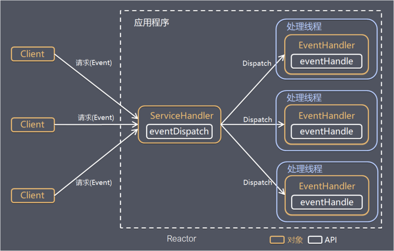

Reactor 模型  
- 用于同步 IO  
- IO 多路复用，通过一个线程负责接收客户端连接  
- 将连接过来的请求交给线程池去处理  

  

Reactor 模型定义的角色  
- Reactor: 负责监听和分配事件。事件包含连接建立就绪，读就绪，写就绪等  
- Acceptor: 负责处理客户端新连接  
- Handler: 负责执行非阻塞读写任务  

根据 Reactor 数量和处理资源池线程的数量，又分为  
- 单 Reactor 单线程 [see](10/1.md)  
- 单 Reactor 多线程 [see](10/2.md)  
- 主从 Reactor 多线程 [see](10/3.md)  

[back](../1.md)  