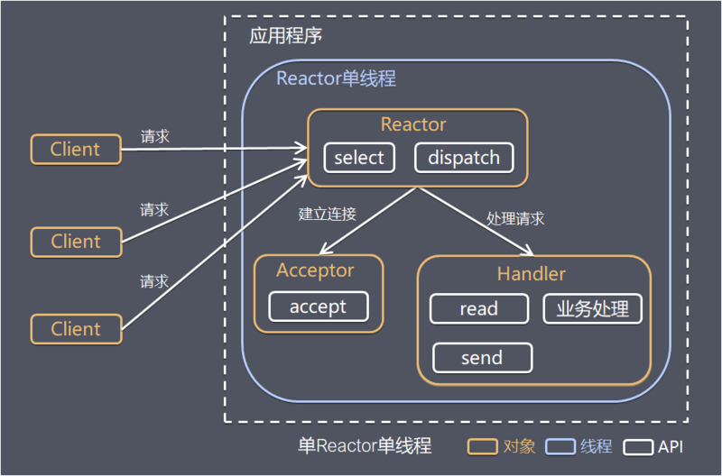

- 监听分发、建立连接和处理请求都在同一个线程中处理  
- 没有多线程、进程通信、竞争的问题，适合应对小容量应用场景  



```Java
public class ReactorServer {
    public static void main(String[] args) throws IOException {
        new Thread(new Reactor(7002), "reactor-001").start();
    }
}
```

```Java
public class Reactor implements Runnable {

    private final Selector selector;
    private final ServerSocketChannel serverSocketChannel;

    public Reactor(int port) throws IOException {
        this.selector = Selector.open(); // 打开一个 Selector
        this.serverSocketChannel = ServerSocketChannel.open(); // 建立一个 Server 端通道
        this.serverSocketChannel.socket().bind(new InetSocketAddress(port)); // 绑定服务端口
        this.serverSocketChannel.configureBlocking(false); // selector 模式下，所有通道必须是非阻塞的
        // Reactor 是一个入口，最初给一个 channel 注册上去的事件都是 accept
        SelectionKey sk = this.serverSocketChannel.register(selector, SelectionKey.OP_ACCEPT);
        // 绑定 accept 事件处理器
        sk.attach(new Acceptor(this.serverSocketChannel,this.selector));
    }

    public void run() {
        try {
            while (!Thread.interrupted()) {
                selector.select();// 就绪事件到达之前阻塞
                // 拿到就绪事件
                Set<SelectionKey> selected = selector.selectedKeys();
                Iterator<SelectionKey> iterator = selected.iterator();
                while (iterator.hasNext()){
                    // 进行任务分发
                    dispatch(iterator.next());
                }
                selected.clear();
            }
        } catch (IOException e) {
            e.printStackTrace();
        } finally {
            if(this.selector != null) {
                try {
                    this.selector.close();
                } catch (IOException e) {
                    e.printStackTrace();
                }
            }
        }
    }

    private void dispatch(SelectionKey key) {
        // 拿到 selectionKey 里附带的处理对象
        Runnable attachment = (Runnable) key.attachment();
        if(attachment != null){
            // 这里使用 run 方法，并未开启新线程
            attachment.run();
        }
    }
}
```

```Java
public class Acceptor implements Runnable {

    private final Selector selector;
    private final ServerSocketChannel serverSocketChannel;

    public Acceptor(ServerSocketChannel serverSocketChannel, Selector selector) {
        this.selector = selector;
        this.serverSocketChannel = serverSocketChannel;
    }

    public void run() {
        SocketChannel socketChannel;
        try {
            socketChannel = serverSocketChannel.accept(); // 三次握手
            new Handler(socketChannel,selector); // 由 Handler 负责 accept 以外的事件处理
        } catch (IOException e) {
            e.printStackTrace();
        }
    }
}
```

```Java
public class Handler implements Runnable{

    private ByteBuffer readBuffer = ByteBuffer.allocate(1024);
    private ByteBuffer sendBuffer = ByteBuffer.allocate(2048);

    private final SocketChannel socketChannel;
    private final SelectionKey selectionKey;
    private int status = READ;

    private final static int READ = 0;
    private final static int SEND = 1;

    public Handler(SocketChannel socketChannel, Selector selector) throws IOException {
        this.socketChannel = socketChannel;

        // 将客户端连接设置为非阻塞模式（selector仅允许非阻塞模式）
        this.socketChannel.configureBlocking(false);
        // 将该客户端注册到 selector，得到一个 selectionKey
        this.selectionKey = socketChannel.register(selector, 0);
        // 附加处理对象
        selectionKey.attach(this);
        // 连接建立完成，将读动作设为感兴趣事件
        selectionKey.interestOps(SelectionKey.OP_READ);
        // 让阻塞的 selector 立即返回 -- selector.select();
        selector.wakeup();
    }

    public void run() {
        try{
            switch (status){
                case READ:
                    read();
                    break;
                case SEND:
                    send();
                    break;
                default:
            }
        } catch (IOException e) {
            e.printStackTrace();
        }
    }

    private void read() throws IOException {
        if(this.selectionKey.isValid()){
            readBuffer.clear();
            int count = socketChannel.read(readBuffer);// read 方法结束，读取完毕。标记着一次就绪事件的结束
            if(count > 0){
                status = SEND;
                selectionKey.interestOps(SelectionKey.OP_WRITE); // 注册写方法
            } else{
                // 读模式下如果拿到 -1，表示客户端已经断开连接
                // 此时将对应的 selectionKey 从 selector 中清除，否则下次还会被 select 到
                selectionKey.cancel();
                // 如果此时继续使用 socketChannel 进行读操作，就会抛出“远程主机强迫关闭一个现有的连接”的IO异常
                socketChannel.close();
                System.out.println("read时连接关闭");
            }
        }
    }

    private void send() throws IOException {
        if(this.selectionKey.isValid()){
            sendBuffer.clear();
            sendBuffer.put("来自 Server 的消息".getBytes());
            sendBuffer.flip();
            int count = socketChannel.write(sendBuffer);
            // 写就绪变成写完毕，标记着一次就绪事件的结束

            if(count < 0){
                // write 场景下取到 -1，说明客户端断开连接
                this.selectionKey.cancel();
                this.socketChannel.close();
                System.out.println("send时连接关闭");
            }

            // 如果没断开连接，则再切换到读
            status = READ;
            selectionKey.interestOps(SelectionKey.OP_READ);
        }
    }

}
```

[back](../10.md)  