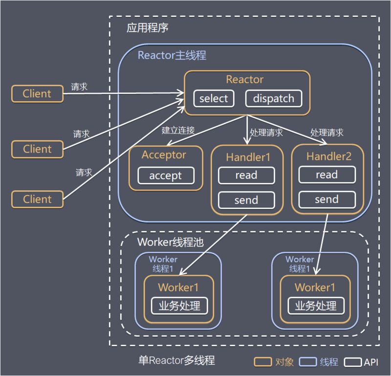

- Reactor 主线程，负责监听客户请求（select），连接事件交给 Acceptor 处理，其他事件交给 handler  
- Worker 线程池，handler 通过 Worker 线程池进行数据的业务处理 



Reactor，Acceptor 和单 Reactor 单线程基本相同 [see](1.md)  

```Java
public class AsyncHandler implements Runnable{

    private ByteBuffer readBuffer = ByteBuffer.allocate(1024);
    private ByteBuffer sendBuffer = ByteBuffer.allocate(2048);

    private final SocketChannel socketChannel;
    private final SelectionKey selectionKey;
    private final Selector selector;
    private int status = READ;

    private final static int READ = 0;
    private final static int SEND = 1;
    private final static int PROCESSING = 1;

    private ExecutorService workors = Executors.newFixedThreadPool(5);

    public AsyncHandler(SocketChannel socketChannel, Selector selector) throws IOException {
        this.socketChannel = socketChannel;
        this.selector = selector;

        // 将客户端连接设置为非阻塞模式（selector仅允许非阻塞模式）
        this.socketChannel.configureBlocking(false);
        // 将该客户端注册到 selector，得到一个 selectionKey
        this.selectionKey = socketChannel.register(selector, 0);
        // 附加处理对象
        selectionKey.attach(this);
        // 连接建立完成，将读动作设为感兴趣事件
        selectionKey.interestOps(SelectionKey.OP_READ);
        // 让阻塞的 selector 立即返回 -- selector.select();
        selector.wakeup();
    }

    public void run() {
        switch (status){
            case READ:
                read();
                break;
            case SEND:
                send();
                break;
            default:
        }
    }

    private void read() {
        if(this.selectionKey.isValid()){
            try {
                readBuffer.clear();
                int count = socketChannel.read(readBuffer);// read 方法结束，读取完毕。标记着一次就绪事件的结束
                if (count > 0) {
                    status = PROCESSING;
                    workors.execute(this::readWorker);
                } else {
                    // 读模式下如果拿到 -1，表示客户端已经断开连接
                    // 此时将对应的 selectionKey 从 selector 中清除，否则下次还会被 select 到
                    selectionKey.cancel();
                    // 如果此时继续使用 socketChannel 进行读操作，就会抛出“远程主机强迫关闭一个现有的连接”的IO异常
                    socketChannel.close();
                    System.out.println("read时连接关闭");
                }
            } catch (IOException e) {
                e.printStackTrace();
                this.selectionKey.cancel();
                try {
                    this.socketChannel.close();
                } catch (IOException ex) {
                    ex.printStackTrace();
                }
            }
        }
    }

    private void readWorker() {
        // 处理 readBuffer
        System.out.println(new String(readBuffer.array()));
        // 状态改为 SEND
        status = SEND;
        // 注册写方法
        selectionKey.interestOps(SelectionKey.OP_WRITE);
        // 因为该 interesOps 写事件是放在子线程的
        // 如果不主动唤醒，selector 处于阻塞状态不会立即进行处理
        this.selector.wakeup();
    }

    private void send() {
        if(this.selectionKey.isValid()){
            status = PROCESSING;
            workors.execute(this::sendWorker);
            selectionKey.interestOps(SelectionKey.OP_READ);// 设置为读事件
        }
    }

    private void sendWorker() {
        try {
            sendBuffer.clear();
            sendBuffer.put("来自 Server 的消息".getBytes());
            sendBuffer.flip();
            int count = socketChannel.write(sendBuffer);
            // 写就绪变成写完毕，标记着一次就绪事件的结束

            if (count < 0) {
                // write 场景下取到 -1，说明客户端断开连接
                this.selectionKey.cancel();
                this.socketChannel.close();
                System.out.println("send时连接关闭");
            }

            // 如果没断开连接，则再切换到读
            status = READ;
        } catch (IOException e) {
            e.printStackTrace();
            this.selectionKey.cancel();
            try {
                this.socketChannel.close();
            } catch (IOException ex) {
                ex.printStackTrace();
            }
        }
    }
}
```

[back](../10.md)  