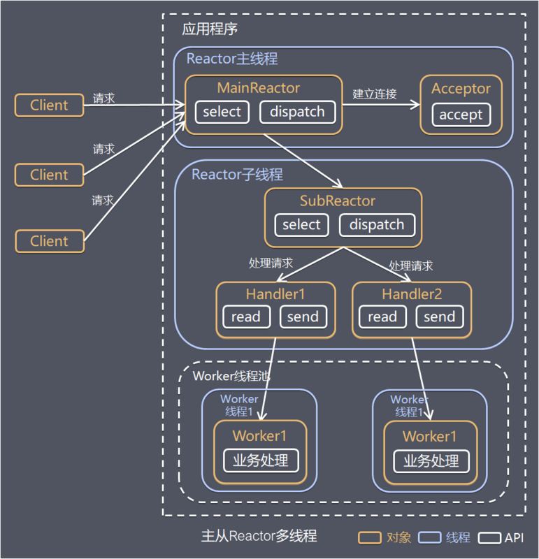

- Reactor 主线程，负责监听客户请求（select），连接事件交给 Acceptor  
Acceptor 处理连接事件后，Reactor 主线程将连接分配给 Reactor 子线程
- Reactor 子线程负责监听读写事件，创建 handler 进行处理  
- Worker 线程池，handler 通过 Worker 线程池进行数据的业务处理  

  

```Java
public class NewAcceptor implements Runnable {

    private final ServerSocketChannel serverSocketChannel;

    private final int coreNum = 2; //Runtime.getRuntime().availableProcessors(); // 获取CPU核心数


    private final Selector[] selectors = new Selector[coreNum]; // 创建selector给SubReactor使用，个数为CPU核心数（如果不需要那么多可以自定义，毕竟这里会吞掉一个线程）

    private int next = 0; // 轮询使用subReactor的下标索引

    private SubReactor[] subReactors = new SubReactor[coreNum]; // subReactor

    private Thread[] threads = new Thread[coreNum]; // subReactor的处理线程

    NewAcceptor(ServerSocketChannel serverSocketChannel) throws IOException {
        this.serverSocketChannel = serverSocketChannel;
        // 初始化
        for (int i = 0; i < coreNum; i++) {
            selectors[i] = Selector.open();
            subReactors[i] = new SubReactor(selectors[i], i); //初始化sub reactor
            threads[i] = new Thread(subReactors[i]); //初始化运行sub reactor的线程
            threads[i].start(); //启动（启动后的执行参考SubReactor里的run方法）
        }
    }

    @Override
    public void run() {
        SocketChannel socketChannel;
        try {
            socketChannel = serverSocketChannel.accept(); // 阻塞获取连接
            if (socketChannel != null) {
                //轮询reactors[] 处理接收到的请求
                System.out.println(String.format("client connect %s,acceptor thread: %s",
                        socketChannel.getRemoteAddress(),Thread.currentThread().getName()));
                socketChannel.configureBlocking(false); //

                subReactors[next].registering(true);
                /*让线下一次subReactors的while循环不去执行
                 selector.select,但是select我们是使用的不超时阻塞的方式，
                 所以下一步需要执行wakeup()
                 * */

                selectors[next].wakeup(); //使一個阻塞住的selector操作立即返回

                SelectionKey selectionKey = socketChannel.register(selectors[next],
                        SelectionKey.OP_READ); // 当前客户端通道SocketChannel
                // 向selector[next]注册一个读事件，返回key

                selectors[next].wakeup();
                /*使一個阻塞住的selector操作立即返回，这样才能对刚刚注册的SelectionKey感兴趣
                 */

                subReactors[next].registering(false); // 本次事件注册完成后，需要再次触发select的执行
                // ，因此这里Restart要在设置回false（具体参考SubReactor里的run方法）
                selectionKey.attach(new AsyncHandler(socketChannel, selectors[next]));
                // 绑定Handler

                //轮询负载
                if (++next == selectors.length) {
                    next = 0; //越界后重新分配
                }
            }
        } catch (IOException e) {
            e.printStackTrace();
        }
    }
}
```

```Java
public class SubReactor implements Runnable {
    private final Selector selector;
    private boolean register = false; //注册开关表示，为什么要加这么个东西，可以参考Acceptor设置这个值那里的描述
    private int num; //序号，也就是Acceptor初始化SubReactor时的下标

    SubReactor(Selector selector, int num) {
        this.selector = selector;
        this.num = num;
    }

    @Override
    public void run() {
        while (!Thread.interrupted()) {
            System.out.println(String.format("%d号SubReactor等待注册中,sub reactor thread:%s", num,Thread.currentThread().getName()));
            while (!Thread.interrupted() && !register) {
                try {
                    if (selector.select() == 0) {
                        continue;
                    }
                } catch (IOException e) {
                    e.printStackTrace();
                }
                Set<SelectionKey> selectedKeys = selector.selectedKeys();
                Iterator it = selectedKeys.iterator();
                while (it.hasNext()) {
                    dispatch((SelectionKey)it.next());
                    it.remove();
                }
            }
        }
    }

    private void dispatch(SelectionKey key) {
        Runnable r = (Runnable) (key.attachment());
        if (r != null) {
            r.run();
        }
    }

    void registering(boolean register) {
        this.register = register;
    }

}
```

[back](../10.md)  