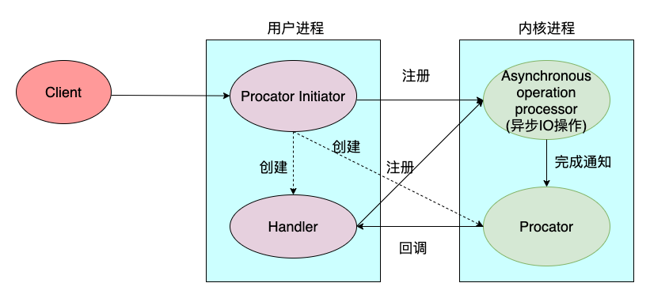

Proactor 模型  
- 用于异步 IO  
- 不等待内核读取数据到用户空间，而是接受读取完成的主动通知  
- 数据准备好后通知 Proactor，然后 Proactor 通知 Handler 进行业务处理，不需要 Selector  
- 依赖于操作系统的支持，目前还不是很完善  
    - windows IOCP 实现了真正的异步 IO
    - linux 2.6 epoll 不完善  

  

[back](../1.md)  