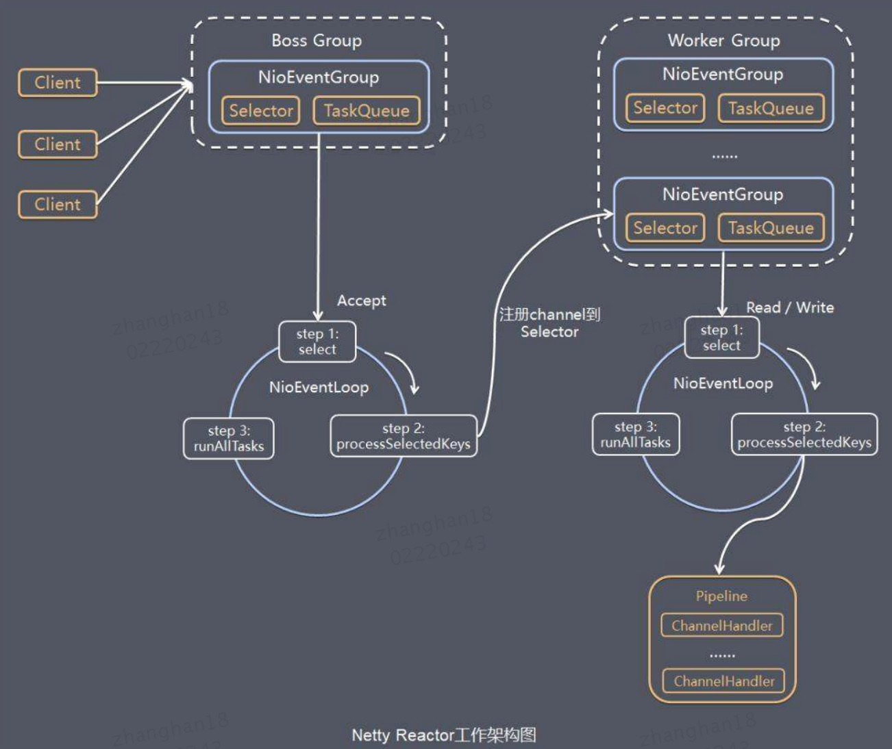

- Server 启动，Netty 从 parentGroup 中选出一个 NioEventLoop 对指定 port 的连接进行监听  
- 当 Client 连接指定 port 创建 Channel 时，Netty 从 childGroup 中选出一个 NioEventLoop 与该 Channel 绑定  
- Chient 通过 Channel 向 Server 发送过来的数据包 ByteBuf，由 Pipeline 中的处理器依次处理  
- Server 如需向 Client 发送数据，需将数据经 Pipeline 处理形成数据包 ByteBuf，然后通过 Channel 发送  

  

[back](../1.md)  