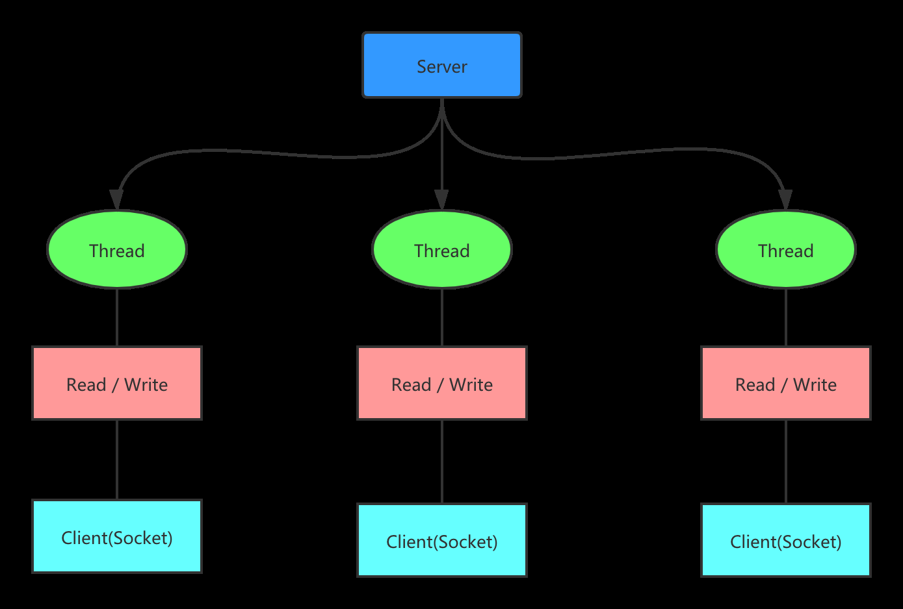
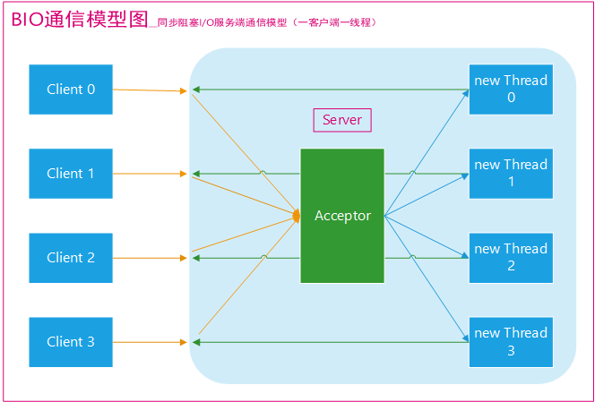
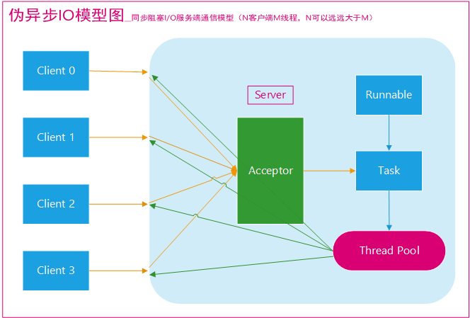

- 客户端和服务端建立 Socket 连接  
- 每一个连接需要一个单独的线程维护读写  
- 面向流的同步阻塞 IO  

过于依赖线程，消耗大量资源，无法应对大量请求场景。适用于 Java 1.4 以前的小型项目  

  
  

---  

伪异步 IO  
- 从线程池里获取 BIO 所需的线程  
- 不需要维护线程的创建和销毁  

  

---  

```Java
// 线程池机制  
ExecutorService newCachedThreadPool = Executors.newFixedThreadPool(2);  
// 创建 ServerSocket  
ServerSocket serverSocket = new ServerSocket(8080);  
int count = 0;
while(true){
    // 监听，等待客户端连接
    final Socket socket = serverSocket.accept();
    newCachedThreadPool.execute(()->{
        // 和客户端通讯的方法  
        handle(socket);  
    })
}
// 连接实例  
// telnet 127.0.0.1:8080
```

[back](../4.md)  