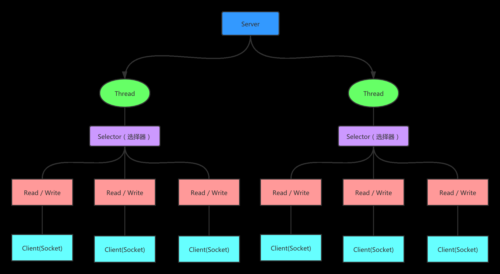

- 一个线程维护多个 Socket 连接（多路复用）  
- 面向缓冲区的同步非阻塞 IO  

  

---  

NIO 模型中的组件  
- channel  
数据传输的通道，读取时从 buffer 中取，写入时写到 buffer 里  
流式 IO 是单向的，而 channel 可以读也可以写，是双向的  
- buffer  
数据经过通道后，缓存到 buffer 中，应用程序在 buffer 中获取数据，传输数据前也是先将数据写到 buffer 中  
实质是一个内存块，底层有一个数组  
- selector  
一个线程对应一个 Selector，负责维护多个 channel  
程序切换到哪个 channel 是由事件 event 决定的，selector 会根据不同的事件在各个 channel 上切换  

channel 的分散和聚集  
- 分散读取：将一个 channel 中的数据分散到多个 buffer 中去  
- 聚集：将多个 buffer 的数据聚集到一个 channel  

java.nio.Buffer [see](2/1.md)  
java.nio.Channel [see](2/3.md)  
java.nio.Selector [see](2/4.md)  
java.nio.channels.ServerSocketChannel [see](2/5.md)  
java.io.RandomAccessFile [see](2/2.md)  

---

原生 NIO 存在的问题  
- NIO 跨平台和兼容性问题  
使用 NIO 在 linux 上正常运行的代码，在 windows 上可能会出问题，因为 NIO 依赖于操作系统对 IO 操作的 APIs  
- 对缓冲区的聚合和分散操作可能会导致内存泄露  
- Bug：Linux 上选择器使用的是 epoll-IO 事件通知工具，存在一个著名的 epoll-bug 可能会导致无效的状态选择和 100% 的 CPU 利用率  
Selector.select() 方法若未选中任何事件将会阻塞，实际上因 epoll-bug 该方法总是不阻塞并立刻返回  

[back](../4.md)  