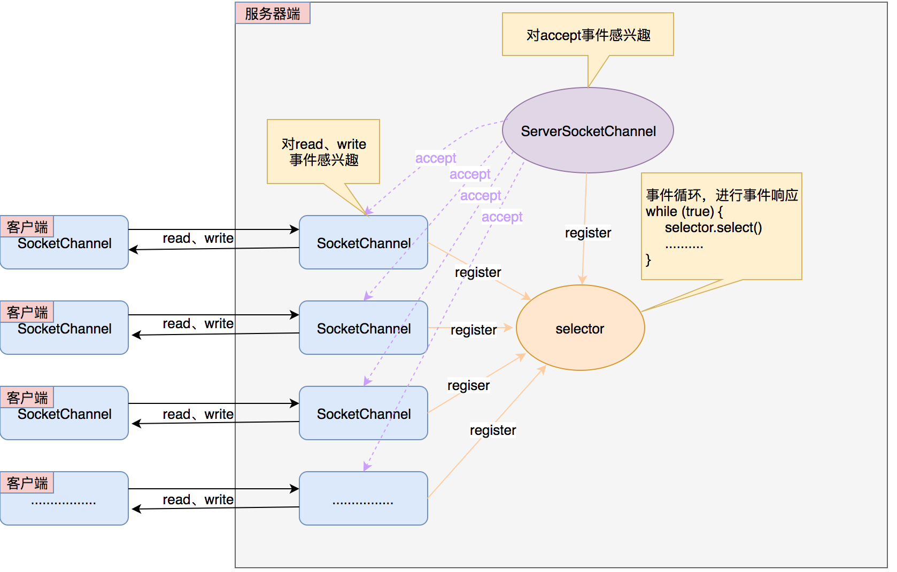

  

服务端  

```Java
public static void main(String[] args) throws IOException {
    ServerSocketChannel serverSocketChannel = ServerSocketChannel.open();
    serverSocketChannel.bind(new InetSocketAddress("127.0.0.1",8080));
    serverSocketChannel.configureBlocking(false);

    Selector selector = Selector.open();

    // 将 channel 注册到 selector
    // OP-ACCEPT 表示 Accept 事件发生时可以由此通道处理
    serverSocketChannel.register(selector, SelectionKey.OP_ACCEPT);

    ByteBuffer readBuff = ByteBuffer.allocate(1024);
    ByteBuffer writeBuff = ByteBuffer.allocate(128);
    writeBuff.put("received".getBytes());
    writeBuff.flip();

    while(true){
        int nReady = selector.select();
        Set<SelectionKey> keys = selector.selectedKeys();
        Iterator<SelectionKey> keyIterator = keys.iterator();

        while (keyIterator.hasNext()){
            SelectionKey key = keyIterator.next();
            keyIterator.remove();

            if(key.isAcceptable()){
                // 接收到新的 channel 并注册到 selector
                SocketChannel accept = serverSocketChannel.accept();
                accept.configureBlocking(false);
                // OP_READ 读操作事件
                accept.register(selector,SelectionKey.OP_READ);
            } else if (key.isReadable()){
                // 处理需要读取的 channel
                SocketChannel channel = (SocketChannel) key.channel();
                readBuff.clear();
                channel.read(readBuff);
                String msg = new String(readBuff.array(), 0, readBuff.position(), CharsetUtil.UTF_8);

                readBuff.flip();
                System.out.println("收到消息： " + msg);
                key.interestOps(SelectionKey.OP_WRITE);
            } else if (key.isWritable()){
                // 处理需要写入的 channel
                SocketChannel channel = (SocketChannel) key.channel();
                writeBuff.rewind();
                channel.write(writeBuff);
                try {
                    TimeUnit.SECONDS.sleep(1);
                } catch (InterruptedException e) {
                    e.printStackTrace();
                }
                key.interestOps(SelectionKey.OP_READ);
            }
        }
    }
}
```

客户端  

```Java
public static void main(String[] args) throws IOException {
    SocketChannel socketChannel = SocketChannel.open();
    socketChannel.connect(new InetSocketAddress("127.0.0.1",8080));

    ByteBuffer readBuff = ByteBuffer.allocate(32);
    ByteBuffer writeBuff = ByteBuffer.allocate(32);

    writeBuff.put("hello".getBytes());
    writeBuff.flip();

    while (true){
        writeBuff.rewind();
        socketChannel.write(writeBuff);
        readBuff.clear();
        socketChannel.read(readBuff);
        try {
            TimeUnit.SECONDS.sleep(1);
        } catch (InterruptedException e) {
            e.printStackTrace();
        }
    }
}
```

[back](../2.md)  