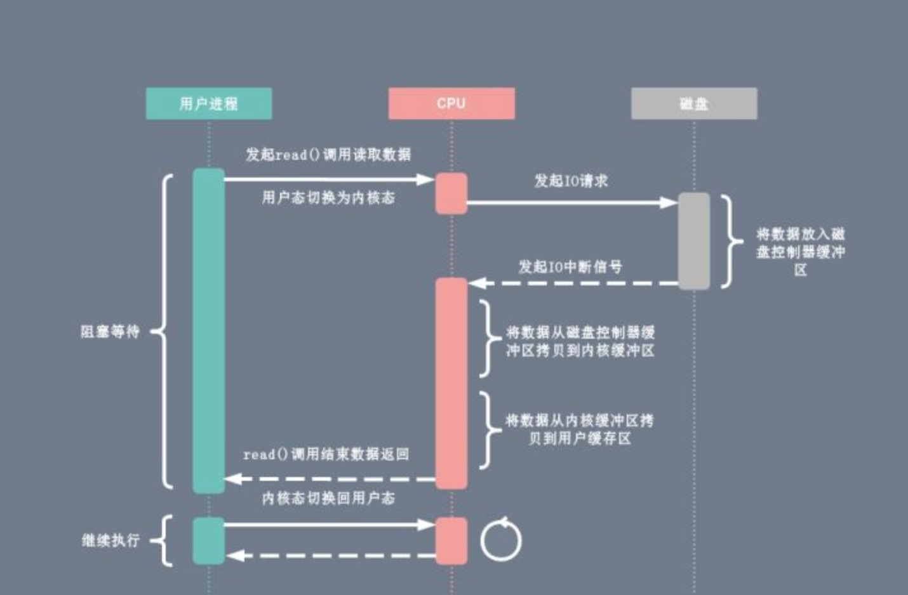
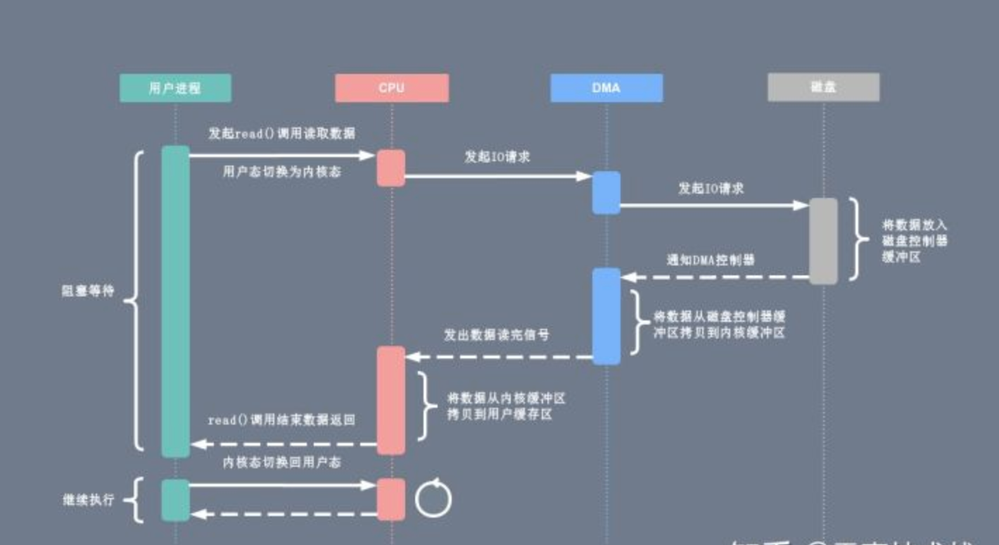

- 轮询方式  
基于死循环对 IO 端口进行不断检测  

- IO 中断  
  

- DMA 传输  
DMA 全称直接内存存取 Direct Memory Access  
允许外围设备直接访问系统主内存的机制  
目前大多数硬件设备都支持 DMA  
CPU 将数据传输工作交给 DMA 控制器，然后继续进行其他工作  
实现 CPU 计算和 IO 操作的并行，提高效率  
  

[back](../5.md)  