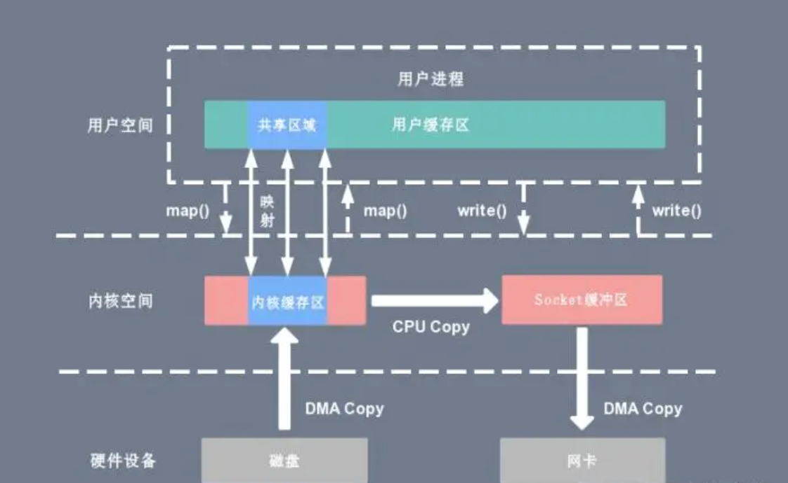

mmap 是 Linux 提供的一种内存映射文件的方法，将进程空间中的虚拟地址映射到硬件上的文件地址  
通过内核读缓冲区 (read buffer) 和用户缓冲区(user buffer) 之间进行映射实现内核与程序的内存共享  
内核读缓冲区 (read buffer) 仍需将数据拷贝到内核写缓冲区 (write buffer)  
4 次上下文切换，1次 CPU 拷贝，2次 DMA 拷贝；对比传统 IO 流程 CPU 拷贝减少了一次    
适用于大文件。小文件的内存映射文件反而会导致碎片空间的浪费  
隐藏的问题：mmap 一个文件时，如果这个文件被另一个进程所截获，write 系统调用就会因访问非法地址被 SIGBUS 信号终止，SIGBUS 默认会杀死进程并产生一个 coredump，服务器可能因此被终止  

  

---

mmap 的方式的 Java 实现   
NIO 中的 `MappedByteBuffer`，可通过 FileChannel 的 `map()` 方法取得，该方法底层调用 mmap 获取数据  
`MappedByteBuffer` 使用堆外虚拟内存，不受 JVM 的 `-Xmx` 参数限制  
在处理大文件时性能很高，但内存占用也高  
打开的文件只有在垃圾回收时才会关闭，这个时间点不确定  
提供了 `unmap()` 方法用于释放内存，但该方法属于 `FileChannelImapl` 的私有方法，无法显式调用  
可通过反射调用 `sun.misc.cleaner` 的 `clean()` 方法手动释放映射占用的内存区域  

MappedByteBuffer 的实现类  
- DirectByteBuffer：实现了 DirectBuffer 接口，维护一个 Cleaner 对象完成内存回收。jvm 参数 -XX:MaxDirectMemorySize    
- HeapByteBuffer：写在 Java 堆内存上的 buffer，底层本质是一个数组。把内容写进 buffer 的速度会快些，由 gc 管理堆内存    

---

```Java
public abstract MappedByteBuffer map(MapMode mode, long position, long size) throws IOException;
```

MapMode  
- READ_ONLY 只读模式  
- READ_WRITE 可读可写模式  
- PRIVATE 写时拷贝模式  

MappedByteBuffer 对比 ByteBuffer 新增的方法  
```Java
    // READ_WRITE 模式下使用  
    // 将缓冲区中的修改强制刷新到本地文件（write）
    public final MappedByteBuffer force() {
        checkMapped();
        if ((address != 0) && (capacity() != 0)) {
            long offset = mappingOffset();
            force0(fd, mappingAddress(offset), mappingLength(offset));
        }
        return this;
    }

    // 将缓冲区的内容载入物理内存，然后返回这个缓冲区的引用  
    public final MappedByteBuffer load() {
        checkMapped();
        if ((address == 0) || (capacity() == 0))
            return this;
        long offset = mappingOffset();
        long length = mappingLength(offset);
        load0(mappingAddress(offset), length);

        // Read a byte from each page to bring it into memory. A checksum
        // is computed as we go along to prevent the compiler from otherwise
        // considering the loop as dead code.
        Unsafe unsafe = Unsafe.getUnsafe();
        int ps = Bits.pageSize();
        int count = Bits.pageCount(length);
        long a = mappingAddress(offset);
        byte x = 0;
        for (int i=0; i<count; i++) {
            x ^= unsafe.getByte(a);
            a += ps;
        }
        if (unused != 0)
            unused = x;

        return this;
    }

    // 判断缓冲区的内容是否在物理内存中  
    public final boolean isLoaded() {
        checkMapped();
        if ((address == 0) || (capacity() == 0))
            return true;
        long offset = mappingOffset();
        long length = mappingLength(offset);
        return isLoaded0(mappingAddress(offset), length, Bits.pageCount(length));
    }

```

[back](../5.md)  