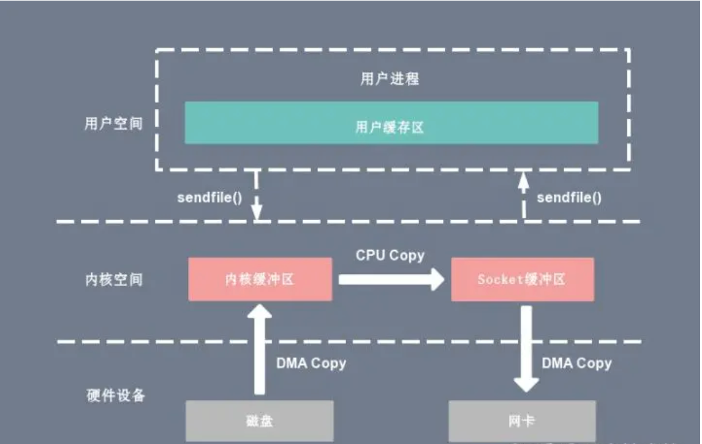

Linux 内核版本 2.1 引入，简化数据传输过程  
用户进程向内核发起 sendFile 指令，内核通过 DMA 从一个硬件获取数据到 read buffer，然后进行一次 CPU 拷贝到 write buffer，直接通过 DMA 写入另一个硬件，整个过程中数据对用户进程不可见  
2次 上下文切换，1次 CPU 拷贝，2次 DMA拷贝；对比 mmap 减少了2次上下文切换    

  

---

sendFile 的 Java 实现  
NIO 中的 `transforTo` native 方法，案例可见 FileChannel  
在 UNIX 和 Linux 系统中，调用这个 native 方法会引起 sendfile 系统调用  

[back](../5.md)  