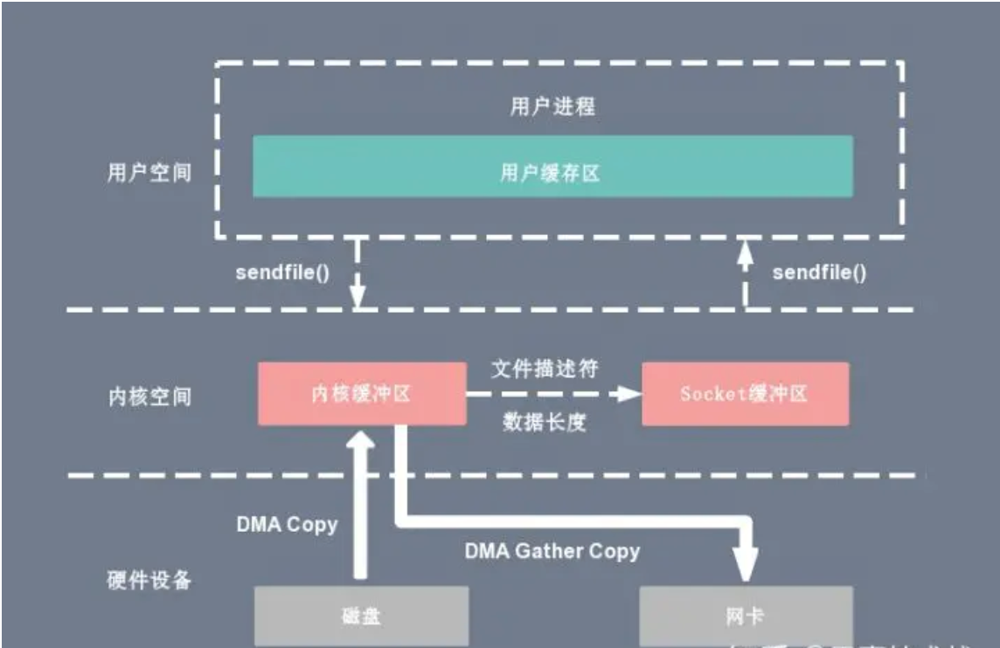

Linux 内核版本 2.4 为 DMA 拷贝引入了 gather 操作。  
将内核空间的读缓冲区 (read buffer) 中对应的数据描述信息（内存地址、地址偏移量）记录写缓冲区 (write buffer) ，然后进行 DMA gather copy，根据写缓冲区中的信息将数据写入硬件  
2次 上下文切换，2次 DMA拷贝；对比 sendFile 减少了1次CPU 拷贝  

  

[back](../5.md)  