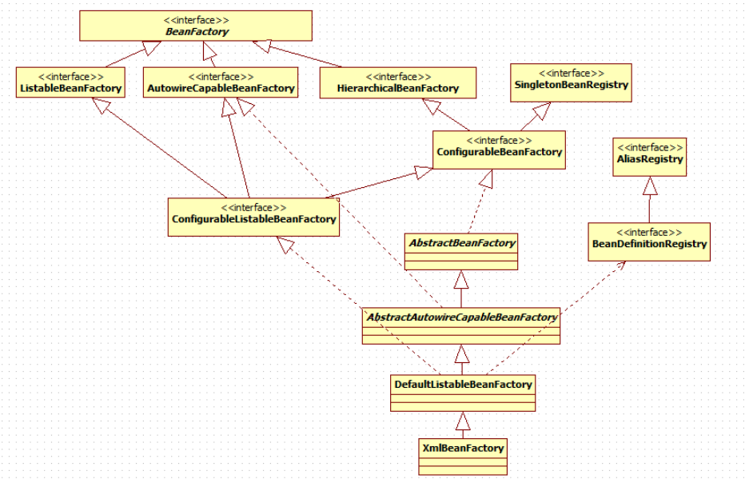

  

四级接口继承体系  
  1. `BeanFactory` 作为一个主接口不继承任何接口，暂且称为一级接口  
  2. `AutowireCapableBeanFactory` `HierarchicalBeanFactory` `ListableBeanFactory` 继承了它，进行功能上的增强，称为二级接口  
  3. `ConfigurableBeanFactory` 称为三级接口，对二级接口 `HierarchiclaBeanFactory` 进行了再次增强，还继承了另一个外来的接口 `SingletonBeanRegistry`  
  4. `ConfigurableListableBeanFactory` 继承了上述的所有接口，称为四级接口  

`AutowireCapableBeanFactory` 提供工厂的装配功能  
`HierarchicalBeanFactory` 提供父容器的访问功能  
`ListableBeanFactory` 可以根据条件返回容器内bean实例的集合  
`ConfigurableBeanFactory` 提供factory的配置功能  
`ConfigurableListableBeanFactory` 集大成者，提供解析、修改bean定义，并初始化单例  

继承的抽象类和实现类：  
  - `AbstractBeanFactory` 抽象类实现了三级接口 `ConfigurableBeanFactory` 的大部分功能  
  - `AbstractAutowireCapableBeanFactory` 抽象类继承自 `AbstractBeanFactory`， 并额外实现了 `AutowireCapableBeanFactory`  
  - `DefaultListableBeanFactory` 继承自 `AbstractAutowireCapableBeanFactory`， 实现了四级接口 `ConfigurableListableBeanFactory`， 并实现了一个外来接口 `BeanDefinitionRegistry`  
  - `XmlBeanFactory` 继承自 `DefaultListableBeanFactory`，重写了一些功能  

[BeanFactory](1/1.md) [ListableBeanFactory](1/2.md) [HierarchicalBeanFactory](1/3.md) [AutowireCapableBeanFactory](1/4.md) [ConfigurebleBeanFactory](1/5.md)  

[back](../2.md)  