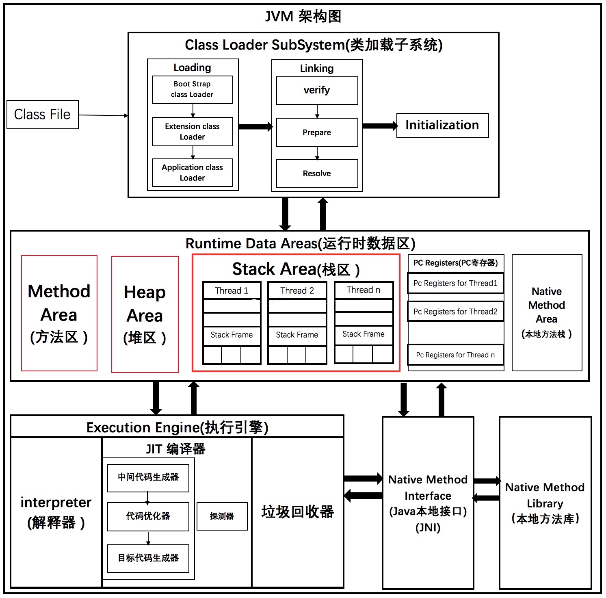

JVM 运行模式有哪两种  [see](7/1.md)  

程序执行方式有哪些 [see](7/2.md)  

JVM 执行流程 [see](7/3.md)  

JVM 的参数格式  [see](7/4.md)  

class 文件字节码结构 [see](7/5.md)  

符号引用和直接引用 [see](7/6.md)  

class中的特殊字符串  
- 类的全限定名 [see](7/7.md)  
- 字段和方法的描述符 [see](7/8.md)  
- 特殊方法的方法名 [see](7/9.md)  

类加载过程 [see](7/6/1.md)  

类加载器的的种类和职责 [see](7/10.md)  

双亲委派模型 [see](7/11.md)  

运行时数据区  
- 线程共享区
    - 方法区 [see](7/12.md)  
    - 堆 [see](7/15.md)  
- 线程空间 [see](7/16.md)  
    - 虚拟机栈 [see](8/2.md)  
    - 本地方法栈  
    - 程序计数器 [see](8/1.md)  

线程独享和线程共享数据区的区别 [see](7/13.md)  

JVM 运行时数据区的使用顺序 [see](7/14.md)  

  

[before](6.md) | [next](8.md)  