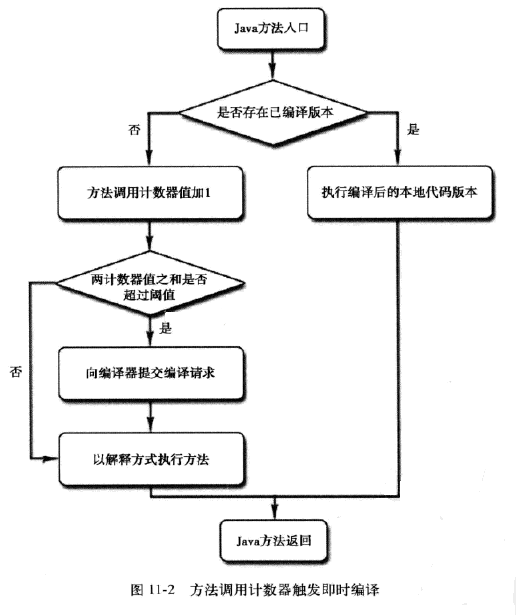

HotSpot 使用基于计数器的热点探测方法  
每个方法准备了两个计数器：方法调用计数器和回边计数器  

阈值：client模式下为 1500 次，Server 是 10000 次  
虚拟机参数：`-XX: CompileThreshold`  

热度衰减： 时间段内调用方法的次数较少，计数器就减小  

方法调用计数器：  
  

回边计数器  
统计一个方法中循环体代码执行的次数，在字节码中遇到控制流向后跳转的指令称为“回边”  

[back](../1.md)  