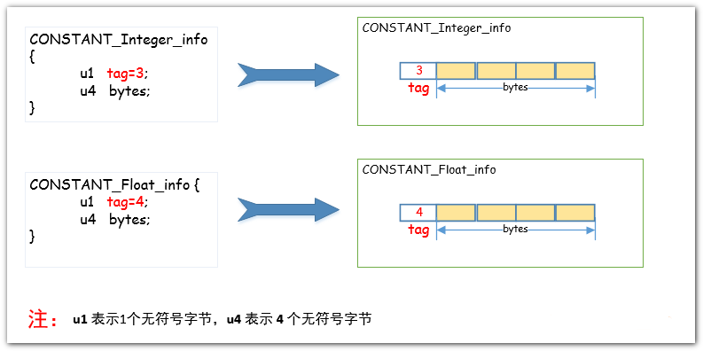

  
  
  
  
  
  

字节码文件中的常量池，相同值只会保留一份  
查看常量池命令 `javap -v #fileName`  

  
  
  
  

JVM 会将某个 Java 类中所有使用到的**类的完全限定名**以**二进制形式的完全限定名**封装成**CONSTANT_Class_info**结构体中  
二进制存储时会把完全限定名中的`.`换成`/`  
一个类至少有两个CONSTANT_Class_info，用来表示自己和父类信息（Object类除外）  
已经import但是没有使用的类不会放置到常量池，仅声明没有new也没有调用任何方法的都不算用到    

  

会进入常量池的字面量  
- final修饰的8中基本类型的值会进入常量池  
- 非final包括static的，只有double、float、long会进入常量池  
- 字符串类型字面量  

[back](../7.md)  