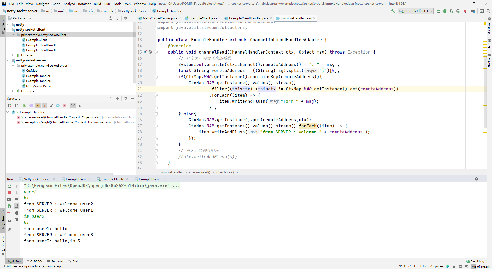

# Channel的主要功能是什么？

Channel 是网络操作抽象类，除了基本的 IO 操作外，还包括了 Netty 框架相关的一些功能    

# 简述Channel、ChannelPipeline、ChannelHandlerContext、ChannelHandler关系是什么？

ChannelHandler 是对 Channel 中数据的拦截处理  
ChannelPipeline 中包含了 ChannelHandler 处理链，决定了处理的顺序  
ChannelHandlerContext 包含了 channel 相关的上下文信息，关联了一个 Handler 同时也绑定了 pipeline 和 channel 信息  

# 用netty实现群聊功能，提交成品结果截图。

