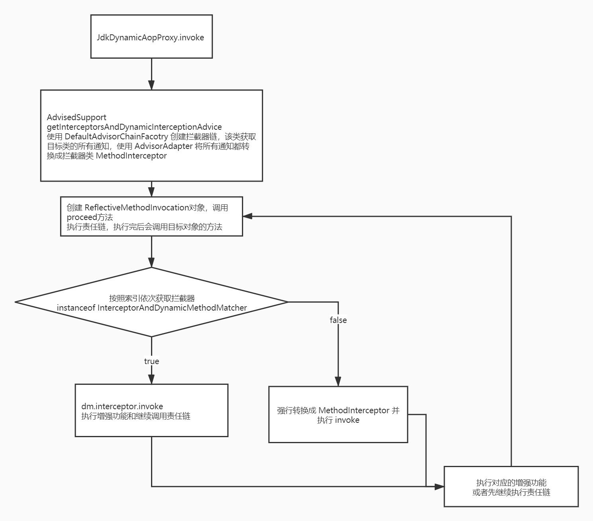

# 通过画图方式画出AOP动态代理执行流程的逻辑（至少7个相关的类都要写出来）  

  

# 写出循环依赖中的三个缓存集合的作用和存储的值的类型  

三级缓存：  
- 一级缓存 `Map<String,Object> singletonObjects`
- 二级缓存 `Map<String,Object> earlySingletonObjects`
- 三级缓存 `Map<String,ObjectFactory<?>> singletonFactories`  

一级缓存用于对容器外提供单例Bean，只有非创建中的Bean才会在一级缓存里  
二级缓存存放创建中的Bean  
三级缓存存储提前暴露的实例的引用，针对该实例可能会产生代理对象，只会被调用一次，存储创建中的Bean  

